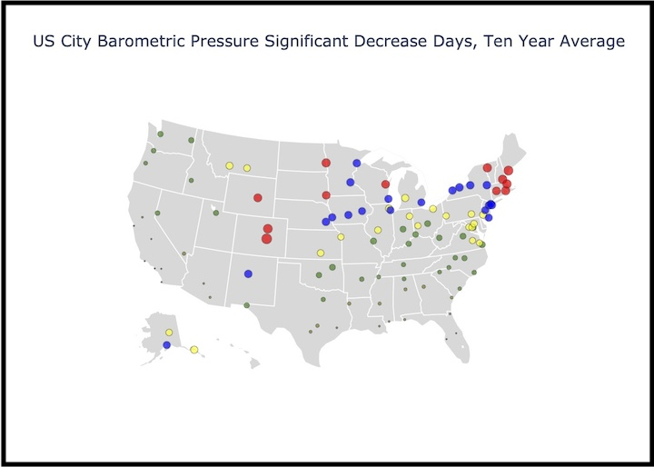

# Weather Data — Full Data Pipeline

*Full codebase:* [github.com/dcremas/WeatherData](https://github.com/dcremas/WeatherData)

## Description

A full data pipeline building a Postgres data warehouse of hourly, by-location
weather observations for **112 US airport stations from 2005 to the present day**,
so that barometric pressure change can be analysed over time and compared across
locations.



## Data sources — and the 2025 migration

This project originally sourced NOAA's **Integrated Surface Database (ISD)** via
the `global-hourly` HTTPS directory. **NOAA superseded ISD in 2025**: nothing was
published after **2025-08-24**, the legacy directory froze at its 2025-10-01
state, no `2026/` directory was ever created, and NCEI retired the HTTPS service
on **2026-07-31**. The AWS mirror `noaa-global-hourly-pds` likewise has no 2026
data, confirming the dataset was retired rather than merely relocated.

Current observations therefore come from **GHCNh** (Global Historical Climatology
Network — hourly), ISD's official replacement, read from the NOAA Open Data
bucket `noaa-ghcnh-pds`. All 112 stations map cleanly: an ISD id is a 6-digit
USAF id plus a 5-digit WBAN, and the GHCNh id is `USW000` + the same WBAN.

| Period | Source | Notes |
|---|---|---|
| 2005 – 2024 | ISD | historical, source now retired |
| 2025 – present | GHCNh | current; refreshed by re-reading the whole year |

Validated against 811,329 overlapping observations: report type matched 100%,
temperature 99.96%, wind 99.82%, visibility 99.94%, precipitation 99.99%. The
remaining differences are almost entirely cases where ISD stored an all-9s
"missing" sentinel that its converters turned into a real-looking number
(`99999` → `295.30` inHg, `9999` → `2236.7` mph), where GHCNh correctly reports
NULL.

**Known gap:** GHCNh itself has no data for **2025-08-30, 08-31 or 09-01**, at
the handover. No source can fill those three days.

### ISD sentinel cleanup

ISD encoded a missing reading as an all-9s code rather than NULL, and the original
loaders converted whatever they found. A missing sea-level pressure therefore
became `295.30` inHg, a missing wind `2236.7` mph, a missing temperature
`1831.8` F. `sql/cleanup_isd_sentinels.sql` replaced these with NULL across the
2005-2024 rows - 2.87M rows locally, 948k on the serving warehouse - bringing the
historical era in line with how GHCNh reports missing data. The script documents
each value's derivation and is safe to re-run.

Two things were deliberately left alone: `cig = 13.67` (ISD code 22000 is
"unlimited ceiling", a real observation) and seven one-off `prp` readings above 20
inches that are mislabelled multi-hour accumulations rather than sentinels.
`obs_baro_impact` was verified byte-identical before and after, since the
sentinels already fell outside its `slp BETWEEN 20 AND 35` and `prp <= 10`
filters.

## Pipeline

```
NOAA Open Data (noaa-ghcnh-pds)
  │  ghcnh_generate.py <year>      112 threaded downloads, 329 cols -> 18
  ▼                                ghcnh_files/<year>/*.parquet
                                   ghcnh_parquet/<year>/data.parquet
  │  ghcnh_process.py <year> [month] [local|remote]
  │    · keeps FM15/FM12 only, normalised to FM-15/FM-12
  │    · rejects readings GHCNh flags suspect/erroneous (QC 2,3,6,7)
  │    · converts to F / inHg / mph / miles / inches
  ▼    · DELETE slice + COPY replacement in ONE transaction
Postgres  observations
  │  sql/analytics_slp_decrease.sql   LAG 3/6/24hr sea-level-pressure deltas
  ▼
obs_baro_impact  ->  consumed by the bokeh_server visualisations
```

Reference dimensions load independently: `loc_data.py` (locations),
`regions_build.py` (regions), `time_zones.py` (time zones).

### Running in AWS, nightly

The pipeline above is what runs by hand. In production it runs itself, once a
day, as two Lambdas driven by EventBridge Scheduler — the same shape as the
apple_weatherkit ELT. Deployment source lives in
`~/Documents/aws/ghcnh_pipeline`.

```
NOAA noaa-ghcnh-pds
  │  ghcnhDownloadS3        07:30 America/Chicago   no VPC
  ▼                         112 parquets -> combined, staged, promoted
s3://noaa-ghcnh-weatherdata/ghcnh_parquet/<year>/data.parquet
  │  ghcnhPostgresqlUpdate  07:45 America/Chicago   in VPC
  ▼                         current + previous month -> observations
EC2 Postgres  ->  obs_baro_impact, loc_subset  ->  bokeh apps
```

Daily because GHCNh republishes the whole in-progress year daily, with about a
two-day lag. The window is the **current and previous month**, not just the
current one: GHCNh keeps revising recent observations, and a current-month-only
job would stop looking at the previous month the moment it rolled over.

The two functions sit on opposite sides of the VPC out of necessity. NOAA's
bucket is in us-east-1, this VPC's only S3 route is a us-east-2 gateway endpoint
and there is no NAT gateway — so the downloader cannot be in the VPC, and the
loader must be, because the warehouse listens on a private address.

The Lambdas run **this repo's** `shared_funcs.py` and `sql/*.sql`, copied into
the layer and the function package at deploy time, so there is one implementation
of the transform rather than a fork. A fix here reaches production by rebuilding
the layer.

Failure is quiet by design: every guard refuses to write rather than writing
something wrong, so a broken run leaves the warehouse serving good but *stale*
data and nothing downstream looks different. CloudWatch alarms on both functions,
plus one that fires if the loader stops running at all, publish to the
`ghcnh-pipeline-alerts` SNS topic.

**The EC2 warehouse is now the system of record.** The nightly job has no route
back to this machine, so the local copy is a dev copy — refresh it on demand
with `python ghcnh_process.py <year> <month> local`.

`bash_scripts/monthly_refresh.sh` and its LaunchAgent are retired; the script is
kept as the manual fallback for when AWS is unavailable or the local warehouse
needs feeding.

### Format differences that matter

GHCNh is not a drop-in replacement for ISD. Each of these silently corrupts a
load if missed, and all are handled in `shared_funcs.py`:

1. **Units.** ISD packed measurements as integers in tenths; GHCNh publishes real
   units. Reusing the ISD converters yields values 10× too small. Visibility also
   changed from metres to kilometres while ceiling height stayed in metres.
2. **Report types lost their hyphen** — `FM15`/`FM12`, not `FM-15`/`FM-12`. They
   are normalised back so existing analytics SQL keeps working.
3. **Provenance is per-variable**, not per row, so `report_type` and `source` are
   derived from the variables in priority order.
4. **Quality codes.** GHCNh grades every reading; ISD had no equivalent. Readings
   flagged suspect or erroneous are stored as NULL — without this a QC-7 reading
   of 219 °C lands in the warehouse as 426 °F.
5. **Precipitation is split across accumulation periods.** ISD packed whatever
   depth was reported into one field, so the period columns are coalesced.
6. **Source codes are not comparable** across the boundary: GHCNh uses 3-digit
   codes, ISD used a single digit.

### Transform performance

`ghcnh_transform` reads the combined parquet **one row group at a time** and
pushes the report-type and period filters down onto the Arrow table before
converting anything to Python.

It used to call `table.to_pydict()` on the whole file and loop over every row —
correct, but it materialised all 5.9M rows across 32 columns as Python objects in
order to keep the ~50k that survive the filters. That peaked at **4.4 GB and 130
seconds** for a single month, which no Lambda would host. Filtering in Arrow
first leaves the per-row mapping byte-identical while holding one row group in
memory: **924 MB and 7.7 seconds** for a two-month window, 24-50x faster on a
month. A whole-year load is unchanged, since almost every row survives the filter
and there is nothing to push down.

### Loading performance

Loads use `COPY ... FROM STDIN`, not row-wise INSERT. The warehouse is reached
through an SSH tunnel with ~44 ms latency, where an ORM bulk insert degrades to
~151 rows/sec — a 1.2M-row year takes over two hours. COPY sustains ~77,000
rows/sec over the same tunnel, so a full year lands in about 40 seconds. The
delete and the COPY commit together, so readers never see a half-loaded slice.

## Usage

```bash
# Refresh the current year end to end
python ghcnh_generate.py 2026
python ghcnh_process.py 2026                  # whole year -> remote
python ghcnh_process.py 2026 7                # July only
python ghcnh_process.py 2026 7 local          # July only -> local

# Rebuild the analytics table
./bash_scripts/run_psql.sh

# Verify file record counts against the warehouse
./bash_scripts/checksum_yearly.sh 2026
```

Loads refuse to run rather than write bad data: an empty or implausibly short
batch aborts before the delete, and a completed month whose coverage stops short
of the month end raises instead of being published as complete.

## Technologies

- Python: `pyarrow`, `polars`, `pandas`, `numpy`
- `SQLAlchemy` and the SQLAlchemy ORM for schema definition
- Postgres, loaded via `COPY`
- Advanced SQL: CTEs, window functions, `CASE` expressions
- Command line and bash scripting

## Folder structure

Top level holds the Python and bash scripts, plus:

- `/metadata` — helper files, including `stations.csv`, the 112-station ISD↔GHCNh
  roster the GHCNh scripts read.
- `/output_files` — exploration output.
- `/sql` — analysis scripts, run both from the command line and by the loader.
- `/bash_scripts` — psql runner, record-count checksum, manual refresh fallback.
- `/aws` — the nightly pipeline: two Lambda handlers, the layer manifest and the
  deploy scripts. See [aws/README.md](aws/README.md).
- `/ghcnh_files`, `/ghcnh_parquet`, `/yearly_files_csv`, `/yearly_files_parquet` —
  bulk source data, not committed (size).

### Removed

The ISD-era loaders — `current_year_generate.py`, `current_year_process.py`,
`update_aws_monthly.py`, `update_aws_yearly.py` and `explore_files.py` — were
deleted once the GHCNh path went live. They targeted the `global-hourly` HTTPS
directory that NCEI retired on 2026-07-31, so none of them can run against any
source that still exists.

They remain in git history as the record of how 2005–2025 was collected:

```bash
git show 613ff24:current_year_process.py
```

## Collaborators

Thank you to the National Oceanic and Atmospheric Administration for making all
of your rich data available to the masses.

## License

Released under the MIT License.
