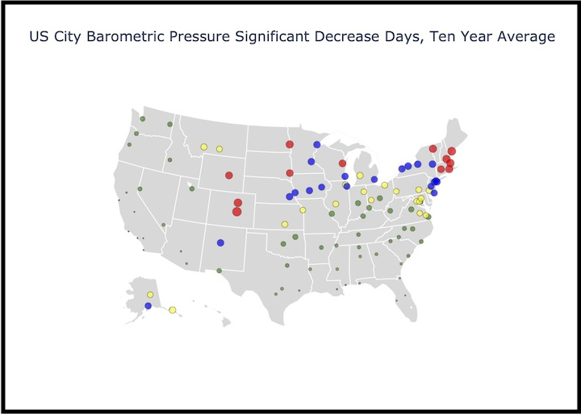

### Title: Weather Data Portfolio Project, Full Data Pipeline.

*To see the full codebase for this project:*
[Link to my github account](https://github.com/dcremas/weather_data)

#### Description:

##### A project intended to build out a full data pipeline for rich location/hourly weather observation metrics from 2005 - till the present day. The purpose is to have a fully updatable Postgres Data Warehouse that can be mined for exploration and analytics on a regular basis.
##### Purpose:

The ultimate purpose of this project was to produce a clean, historical Data Warehouse of by location, by hour observational weather data to be able to analyze the impact of baromtric pressure changes over time, and in comparison of locations.  The data  warehouse is to serve as the main repository of information to be able to explore and analyze. 

##### Data Pipeline Process:

- Access a rich set of historical by year/by location csv files from the NOAA remote repository.
- Utilizing Python scripts to ingest the historical files onto my local computer, grabbing only what is necessary for the Data Warehouse.
- Build out Python scripts to fully clean and transform the data so that it is ready for the Data Warehouse.
- Harness the full capabilities of SQLAlchemy and the SQLAlchemy ORM to create the schemas for the Postgres Relational Database.
- Create SQLAlchemy sessions to take the cleaned data and commit to the Postgres Database.
- Utilize Jupyter notebooks and the pandas and plotly libraries to transform the data from the Warehouse into rich visualizations.

##### Technologies:

1. Python and various standard library modules.
2. The Pandas and Numpy third-party packages.
3. SQLAlchemy and SQLAlchemy ORM.
3. Postgres database.
4. Knowledge of data cleaning and tidying.
5. Advanced SQL techniques including: CTE's, Window Functions and CASE Statements for data analysis and aggregation.
5. Command Line and Bash Scripting.

##### Folder Structure:

Main Level: Includes the python scripts, jupyter notebook and bash scripts as well as the folders for the following:

- /metadata - helper files created to assist in querying the Data Warehouse.
- /output_files csv files used for data exploration.
- /sql - scripts produced for analysis and output.
- /yearly_files - not committed to the GitHub repo due to amount and size.

##### Running the Bash Script:

Not produced yet.

##### Collaborators:

Thank you to the National Oceanic and Atmospheric Administration for making all of your rich data available to the masses.

##### Licen
